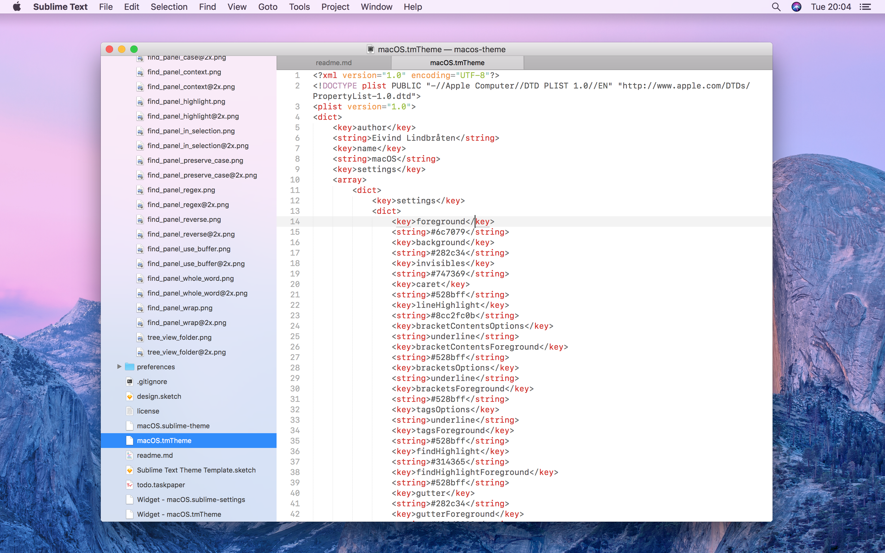

# macOS theme for Sublime Text

A theme for Sublime Text, aming for a full native macOS feel, always updated with latest macOS trends. Xcode is main app for design inspiration.

## Roadmap

- Fine tune details down to pixel level, to give it 100% macOS feel
- Add file type icons for all file types, based on icon design of Xcode's navigation bar
- Create a light and dark color scheme based on Xcode's default and dusk color schemes

## Features

- Some native macOS file type icons added
- Add fake light vibrancy appearance to the sidebar (will add setting to disable)
- Tab bar exactly mimics Xcode's tabs
- Sidebar exactly mimics Xcode's sidebar
- Uses native macOS fonts